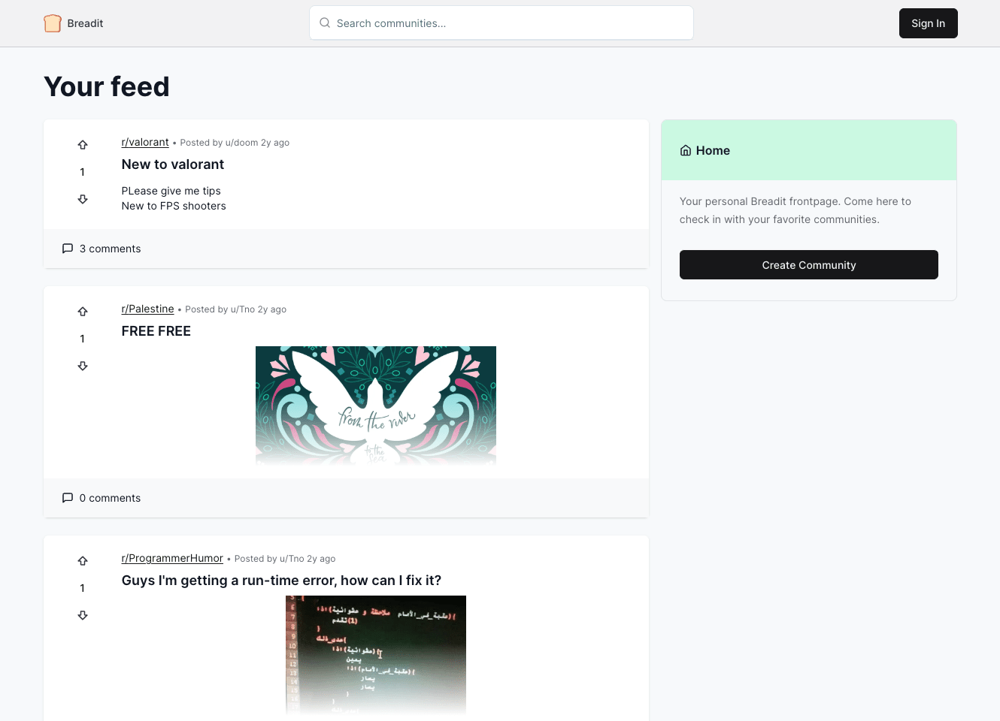
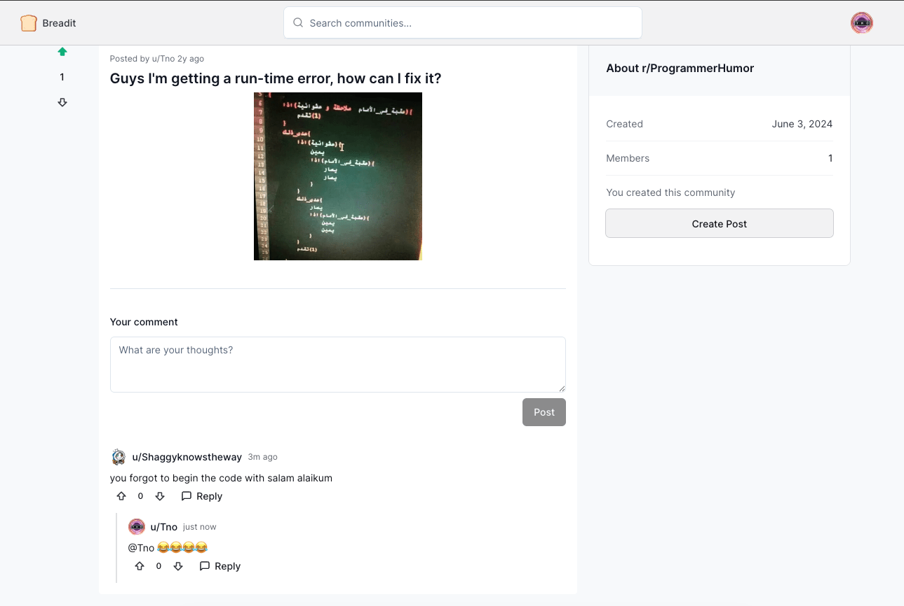
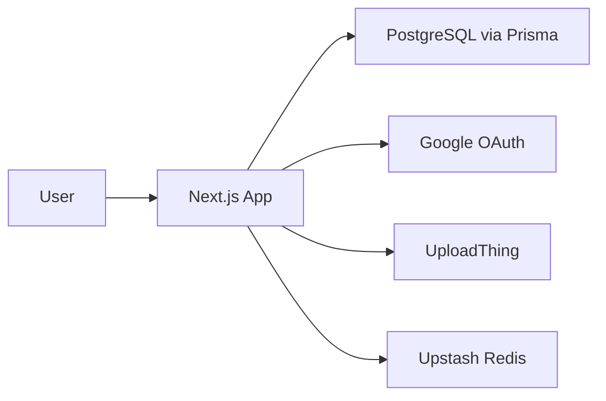
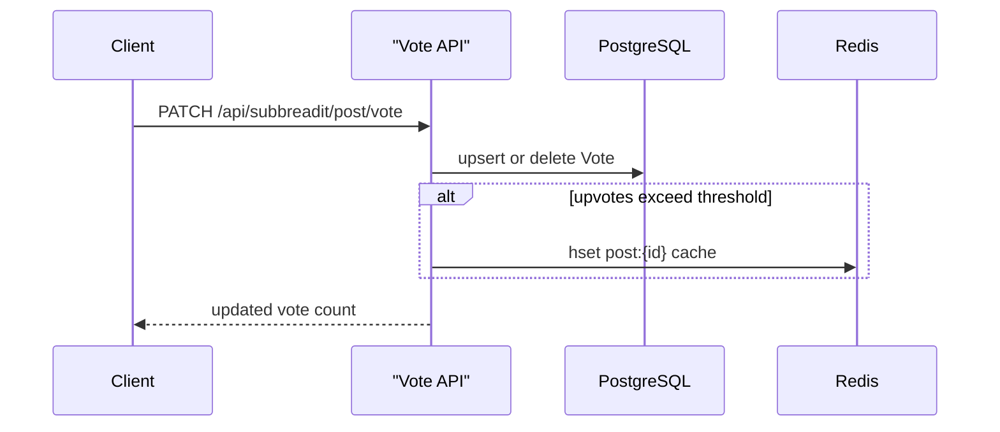

# Breadit

A Reddit-style community platform built with Next.js App Router and TypeScript,
featuring Google OAuth, rich text posts, Redis-backed caching, and infinite
scroll.

**Live demo:** [breadit.moh-sa.dev](https://breadit.moh-sa.dev) · **Portfolio:**
[moh-sa.dev](https://moh-sa.dev) · **LinkedIn:**
[linkedin.com/in/moh-sa](https://linkedin.com/in/moh-sa)



<details>
<summary>More screenshots</summary>



</details>

## Features

- Google OAuth authentication with NextAuth and a sign-in modal implemented via
  Next.js Intercepting Routes
- Home feed shows all posts when signed out; switches to subscribed communities
  when signed in
- Infinite scroll powered by TanStack Query and a paginated `/api/posts`
  endpoint
- Rich post editor via Editor.js — supports headers, lists, images, code blocks,
  embeds, and tables
- Upvote/downvote posts and comments; vote counts are cached in Redis after a
  threshold
- Nested comment threads
- Community search with debounced live results
- Protected routes: creating a community or submitting a post redirects
  unauthenticated users to sign-in
- Image uploads in the editor via UploadThing
- Username settings page

## Tech Stack

| Layer            | Technology                     |
| ---------------- | ------------------------------ |
| **Framework**    | Next.js App Router, TypeScript |
| **UI**           | React, Tailwind CSS, Radix UI  |
| **Data**         | PostgreSQL, Prisma             |
| **Auth**         | NextAuth (Google OAuth)        |
| **Client state** | TanStack Query                 |
| **Rich text**    | Editor.js                      |
| **Storage**      | UploadThing                    |
| **Cache**        | Upstash Redis                  |
| **Validation**   | Zod, react-hook-form           |

---

## Quick start

**Prerequisites:** Node.js 18+, Yarn, PostgreSQL, and accounts for
[Google OAuth](https://console.cloud.google.com/),
[UploadThing](https://uploadthing.com/), and
[Upstash Redis](https://upstash.com/).

```bash
git clone https://github.com/moh-sa/breadit.git
cd breadit && yarn install
cp .env.example .env
npx prisma db push
yarn dev
```

**Google OAuth:** Add `http://localhost:3000/api/auth/callback/google` as an
authorized redirect URI in your Google OAuth app.

Fill in `.env` — `.env.example` documents every variable.

> `INFINITE_SCROLL_PAGINATION_RESULTS` is set to `2` in `src/config.ts` for demo
> purposes. Raise it for production.

---

## Architecture

### System overview



All API logic lives in Next.js Route Handlers under `src/app/api/`. There is no
separate backend server.

### Key directories

| Path                  | Role                                                          |
| --------------------- | ------------------------------------------------------------- |
| `src/app/`            | App Router pages and API route handlers                       |
| `src/app/@authModal/` | Parallel route for the intercepted sign-in/up modal           |
| `src/app/r/[slug]/`   | Community pages, post submission, post detail                 |
| `src/app/api/`        | REST-style handlers — posts, votes, comments, search, uploads |
| `src/lib/`            | Database client, auth config, Redis client, Zod validators    |

### Vote caching flow

Hot post pages skip the database entirely by reading from Redis. The cache is
written after votes cross a threshold:



Post detail pages check Redis first; if no cache exists, they fall back to
PostgreSQL and serve the result.
